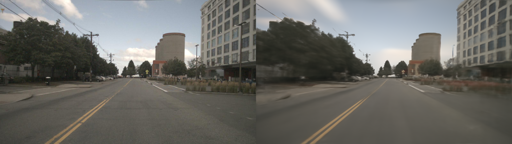

# Master Thesis of LinGaoyuan: The Application of Transformer-based Models in Dynamic Outdoor Scenarios

Hello, my name is Lin Gaoyuan, and I am currently pursuing a master’s degree in Automotive Engineering at TUM. This repository contain the corresponding programm of my master thesis.

[My Paper](docs/assets/Master_Arbeit.pdf)

This repository is built based on GNT's [offical repository](https://github.com/VITA-Group/GNT)

## Introduction

This project is my master thesis, which is mainly focus on the application of transformer network based NeRF model in outdoor scenario.  My master thesis was completed at [TUM info6](https://www.ce.cit.tum.de/air/home/).  The supervisor of my master thesis is [Prof. Dr.-Ing. habil. Alois C. Knoll](https://www.ce.cit.tum.de/air/people/prof-dr-ing-habil-alois-knoll/), while the advisor is Xiang Gao, M.Sc. Here I would like to thank them for their guidance and help in my master thesis.

Recently, two studies, GNT and ReTR, have explored the potential of transformer-based NeRF models for rendering and reconstructing single objects or indoor scenes. Inspired by their approaches, I investigated the feasibility of extending these methods to outdoor environments in my master’s thesis. To achieve this, I leveraged the rendering networks from both studies and applied them to outdoor scenes using the NuScenes dataset. Additionally, I made specific modifications to the original NuScenes data to better align with my research requirements. 

In my master thesis, I mainly completed the following tasks:
1. Generate the masks of vehicles and pedestrians in the NuScene dataset.
2. Explore the effect of rendering/reconstruction of transformer network based rendering model(GNT's and ReTR's rendering network) in NuScene dataset.
3. Compare the effect of different approachs of feature extraction(GNT feature encoder/ReTR feature encoder)
4. Integrate some optimization module such as anti-aliasing module to rendering model.


Due to my limited practical experience and coding knowledge, I structured the implementation of my master’s thesis based on the foundational framework and logic of GNT’s original code. Additionally, I integrated relevant components from the ReTR rendering model into my work to incorporate its key functionalities. I am deeply grateful to the authors of GNT and ReTR for their inspiring research, which has significantly contributed to my thesis. If any further clarification or additional annotations are needed, please feel free to contact me.

Due to the limitation of computational resource(RTX4090) and training time(10 hour), I can only generate finally reconstructed effect with 26.82 PSNR and 0.8488 SSIM. I believe the performance can be further enhance in the future.

Here give a example of my result, left is ground truth image, right is predicted image:


## Installation

Clone this repository:

```bash
git clone https://github.com/TumLinGaoyuan/Master_thesis_LinGaoyuan.git
cd Master_thesis_LinGaoyuan/
```
Then install the requirements.txt file
```bash
pip install -r requirements.txt
```

## Datasets

I use the data from [NuScene](https://www.nuscenes.org/nuscenes) as the basic dataset in my master thesis. NuScene dataset consist of different scenes and I mainly use the scene-0075 and scene-0032 of them. In addition to original information provide by NuScene, I also do some data pre-processing to add some new information according to the specific requirement of my master thesis:

1. Generate the masks of vehicles and pedestrians with the help of [mmdetection3D](https://github.com/open-mmlab/mmdetection3d) and [Segment Anything](https://github.com/facebookresearch/segment-anything).
2. Generate the masks of sky area with the help of [Depth-Anyhting-V2](https://github.com/DepthAnything/Depth-Anything-V2).
3. Generate the predicted depth value with the help of [Depth Anything V2 for Metric Depth Estimation](https://github.com/DepthAnything/Depth-Anything-V2/tree/main/metric_depth)

Thanks to these open source libraries for helping us with our experiments !!!

All dataset within the project folder must follow the below organization.
```bash
├──data/
    ├──Nuscene/
	    ├──scene-0075/
		    ├──RGB/
		    ├──depth_sky_mask_v2/
		    ├──depth_value_metric_v2/
		    ├──images_info_dictionary_train.json
		    ├──images_info_dictionary_val.json
```


## Run

By specifying the indicator parameters in configs/config_Nuscene.txt, you can call different modules. Some indicator parameters are shown in following. For details, see the paper.
```bash
resize_image: True/False
use_volume_feature: True/False
use_retr_feature_extractor: True/False
use_retr_model: True/False
sample_with_prior_depth: True/False
update_prior_depth: True/False
cov_criteria: True/False
depth_loss_criteria: True/False
aliasing_filter: True/False
aliasing_filter_type: single filter/CNN/filter bank
```

### Training

```bash
python3 train_LinGaoyuan.py --config configs/config_Nuscene.txt --train_scenes scene-0075 --eval_scenes scene-0075
```

### Pre-trained Models

I provide the several pre-trained models which has been trained in scene-0075 with 100000 step. To reuse pretrained models, download the required checkpoints [model_100000.pth]() and [sky_model_100000.pth](),  and then place in appropriate directory. If you want to continue the training process, you should construct a directory like following organization:
```bash
├──out/
    ├──Nuscene-scene-0075-final_version_train/
	    ├──args/
	    ├──config/
	    ├──model_100000.pth
	    ├──sky_model_100000.pth
``` 
Then run the `train_LinGaoyuan.py`

You also can operate the evaluation process, the directory should look like:
```bash
├──out/
    ├──Nuscene-scene-0075-final_version_eval/
	    ├──args/
	    ├──config/
	    ├──model_100000.pth
	    ├──sky_model_100000.pth
``` 

Then proceed to evaluation

Notice: You may need to check if the expname in ../configs/config_Nuscene.txt is consistent with the folder's name of path.

### Evaluation

```bash
# single scene
python3 eval_LinGaoyuan.py --config configs/config_Nuscene.txt
```


## Cite this work

If you find my work useful for your own research, please consider citing:

```
@inproceedings{
    LinGaoyuan-master-thesis,
    title={The Application of Transformer-based Models in Dynamic Outdoor Scenarios},
    author={Gaoyuan Lin},
    year={2024},
    url={https://github.com/TumLinGaoyuan/Master_thesis_LinGaoyuan}
}
```
